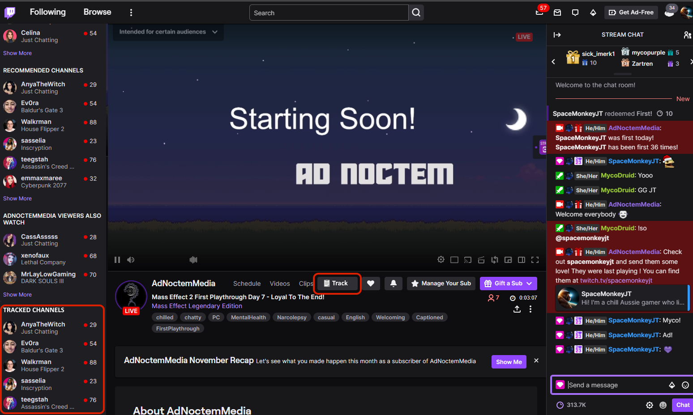

Use case: As a streamer I want to keep track of potential raid targets (without following them) that I can view at the end of stream to help me choose someone to raid.

## Concept 1 - Web site

Essential features:

- Search for channels by username
- Save channels to favourites
- See which are live and for how long, what they're playing, etc

Nice to have features:

- Have multiple named lists of favourites for different purposes
- Also show followed channels, perhaps as a separate list

Could be implemented as a table, with sortable/filterable columns:

- Profile Pic
- Username
- Status
- Category
- Title
- Viewers
- Uptime
- Bio

Table usage:

- Click on column headers to sort/filter by that column
- Click on star button next to row to unfavourite
- Click on profile pic or username to view their Twitch channel
- Click on copy button next to username to copy it to the clipboard (for use with /raid command)

Searching:

- Search box at top (separate from the table) to enter a streamer name (with autocomplete)
- Have search results displayed in a similar table (maybe in a popup window) with buttons to favourite them

Table mockup:

| ⭐ | Profile Pic         | Username | Status   | Category | Title                   | Viewers | Uptime  | Bio |
|-|---------------------|----------|----------|----------|-------------------------|---------|---------|-----|
| ⭐ |  | Jill     | 🔴 Live  | Jisatsu  | 🔴 New Chillas Art! 🔴 | 522     | 1:30:43 | Hiii I'm Jill! I'm a variety streamer, challenge runner, and speedrunner. Lara Croft is my hero ♡ |
| ⭐ |    | AdNoctemMedia | Offline | Dead By Daylight | Chill Pre-Holiday Stream! Maybe Variety Games, Maybe Mass Effect, Definitely Good Times | - | - | Chill gamer building a positive space and enjoying interacting with you all! I enjoy RPGs, shooters, survival, and games with story. Here you'll find welcoming community, lots of conversation, and chill gameplay! All are appreciated. Lurkers welcomed! Contact - adnoctemmedia@gmail.com |

## Concept 2 - Browser extension

A different concept would be to make a browser extension to add a track feature into the Twitch website:

- Show a track button on a viewed channel
- Show tracked channels in the left side bar, e.g. below the other sections

Pros:

- Easier integration being hooked directly into Twitch

Cons:

- Could be challenging to do the auth and page injection
- Only shows limited information about the tracked channels

Mockup:

